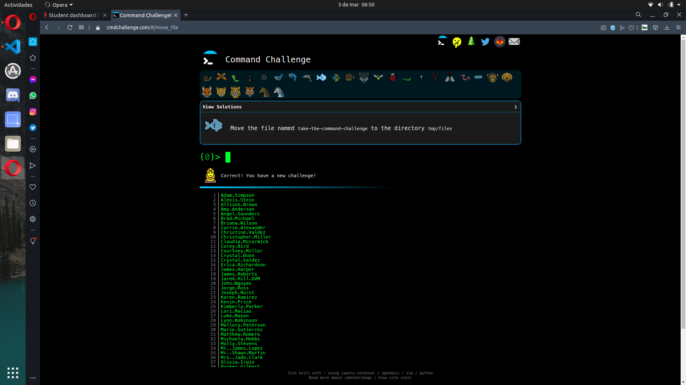

# Command line for the win

## Resources:books:
Read or watch:

---
## Learning Objectives:bulb:
CMD CHALLENGE is a pretty cool game challenging you on Bash skills. Everything is done via the command line and the questions are becoming increasingly complicated. It’s a good training to improve your command line skills!

## Goals

### 0. First 9 tasks

### 1. Reach 18 completed tasks

### 2. Reach the perfect cube, 27

## Author
* **Marianella Monroy Ortiz** - [marianellamonroyortizhb](https://github.com/marianellamonroyortizhb)
